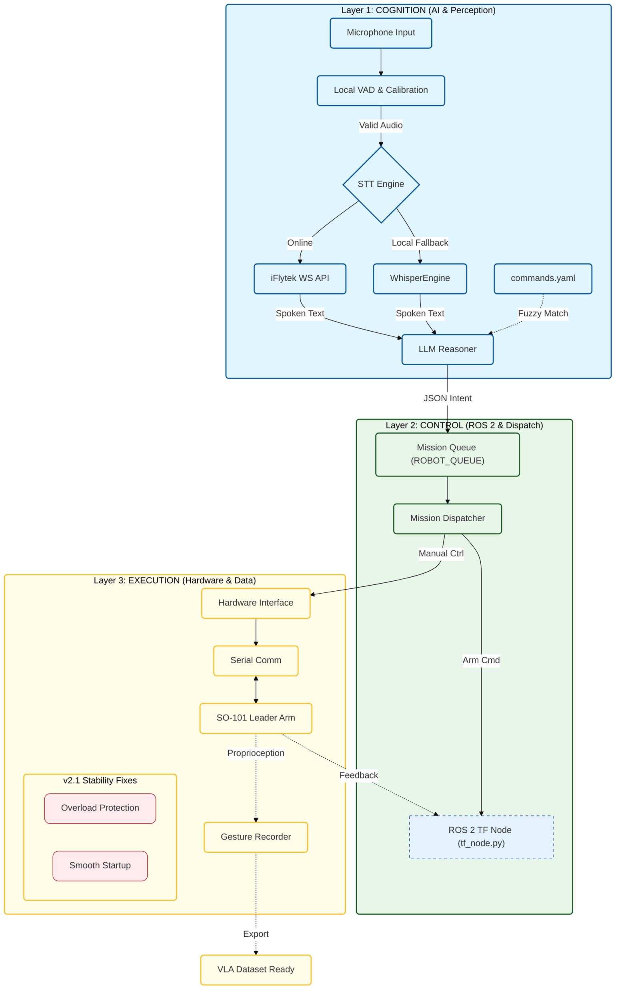

# Voice-Robot: An Embodied AI Interaction System with LLM & ROS 2

[](https://docs.ros.org/)
[](https://www.python.org/)
[](https://github.com/huggingface/lerobot)

## 📖 Project Overview
**Voice-Robot** is an end-to-end **Embodied AI control pipeline** for the SO-101 robotic arm. It bridges the gap between high-level human natural language (including Mandarin and Southwestern dialects) and low-level hardware execution. By integrating **LLM reasoning** with the **ROS 2** communication framework, the system can parse ambiguous instructions into precise robotic trajectories.

> **Engineering Highlight:** Features a robust multi-threaded architecture with optimized VAD (Voice Activity Detection), automated hardware overload protection, and data collection interfaces for training future Vision-Language-Action (VLA) models.

---

## 🏗️ System Architecture
The following diagram represents the integrated pipeline, derived directly from the project's codebase (`voice_robot.py`, `tf_node.py`, `llm_reasoner.py`, and `lerobot_hardware.py`).



---

## 🚀 Core Features

* **LLM-Based Intent Reasoning:** Uses LLM (GPT/Qwen) to parse ambiguous, non-standard natural language into structured JSON robot commands, ensuring robust intent extraction.
* **ROS 2 & Kinematics Monitoring:** Dedicated `tf_node.py` broadcasts the **TF Tree** and calculates real-time Forward/Inverse Kinematics based on the URDF model, viewable in RVIZ.
* **Hardware Overload Protection:** Implements critical engineering safety logic in `lerobot_hardware.py` to reset servo error states (`clear_overload_error`) and prevent damage.
* **Embodied Data Capture:** Gesture Recording module is ready to generate VLA (Vision-Language-Action) datasets for future policy model training.
* **Multi-Dialect STT:** Specifically optimized for Mandarin and Southwestern dialects (Chongqing/Sichuan) through dialect-specific API config and fuzzy keyword matching.

---

## 🛠️ Installation & Setup

### Prerequisites

* Ubuntu 22.04 + ROS 2 Humble (Recommended) or Foxy
* Python 3.10+
* SO-101 Robotic Arm (or simulated environment)

### Environment Configuration

1. **Clone the repository:**
```bash
git clone [https://github.com/elilin349-eli/Robot-Interaction.git](https://github.com/elilin349-eli/Robot-Interaction.git)
cd Robot-Interaction

```


2. **Install Dependencies:**
```bash
pip install -r requirements.txt 
# Includes: rclpy, numpy, sounddevice, websocket-client, scservo_sdk, python-dotenv

```


3. **Setup Keys:**
Copy `env.example` to `.env`, then update your iFlytek and LLM API credentials in `.env` only (do not commit `.env`).

### Secret Leak Emergency Handling

If a real key was ever committed:

1. Revoke the exposed key immediately and create a new one.
2. Replace all real keys in tracked files with placeholders.
3. Rewrite git history to remove leaked values, then force-push:

```bash
pip install git-filter-repo
git filter-repo --replace-text <(echo 'YOUR_LEAKED_KEY_HERE==>REMOVED')
git push --force --all
git push --force --tags
```

> Note: closing security alerts without revoking/rotating the key does not sufficiently address the issue.

---

## 📂 File Structure

* **`voice_robot.py`**: The central mission control. Manages the high-level voice interaction loop, VAD, threading, and safe system shutdown.
* **`tf_node.py`**: A specialized **ROS 2 Node** that handles kinematics and broadcasts the **TF Tree** for visualization.
* **`llm_reasoner.py`**: The "brain" of the robot, leveraging LLMs to parse natural language into structured JSON commands.
* **`lerobot_hardware.py`**: Low-level hardware abstraction layer with servo communication, **v2.1 overload protection**, and VLA data collection interfaces.
* **`commands.yaml`**: Configuration file for mapping multi-dialect keywords to robot actions and customized TTS feedback.

```

```
